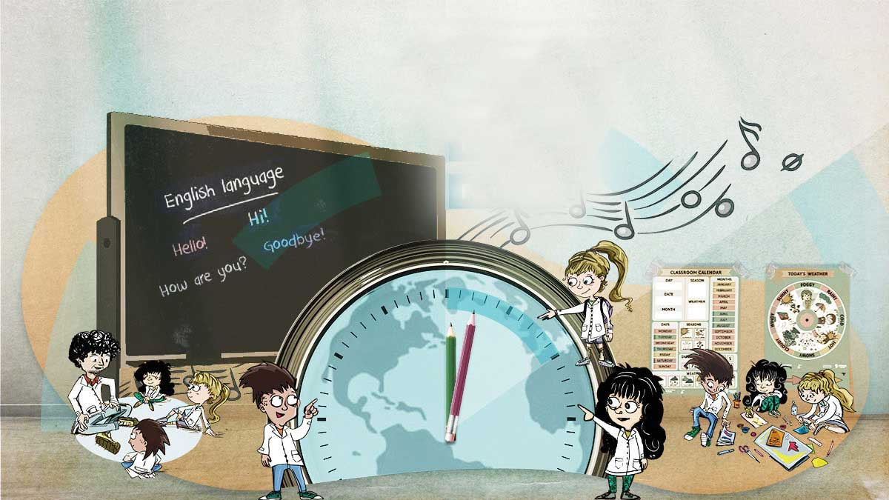

# portadas-modulos
Plantillas para portadas interactivas de módulos del campus virtual de isep-cba.edu.ar 

`
<!--PRESENTACION CON BOTONES DE IMAGEN 
    Copiar desde aquí-->
    
    

        
        <!--Imagen de fondo (para cambiar, reemplazar la URL en src="") -->
        
        
            <!--BOTÓN 
            href= colocar URL de dirección del enlace
            style= top (porcentaje de distancia del techo del contenedor)
            left (porcentaje de distancia del margen izquierdo del contenedor)
            img src= (ubicación de la imagen del botón)
            -->
            

            <!--Los siguientes botones son réplicas del anterior con distintas ubicaciones-->

            
            
            
            
            
            

    

    <!--PRESENTACION CON BOTONES DE IMAGEN 
    Copiar hasta aquí--> 
    `